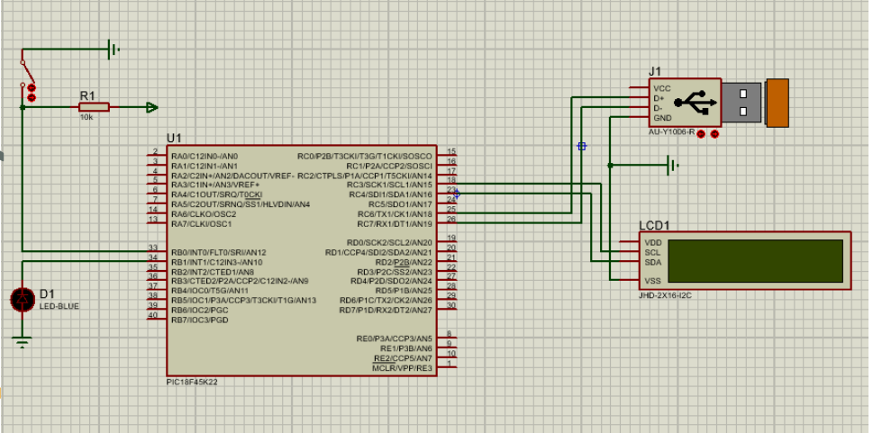

# Proyecto final

## Integrantes
sergio nicolas moreno pulido
steven caro bernal Carlos Andrés
Castañeda Delgado
## Nombre del proyecto: 
JUEGO DE ESTRELLA
QUE ESQUIVA
## Documentación

## Diagramas

<video controls src="Video de WhatsApp 2025-05-27 a las 11.35.16_01c44fc2.mp4" title="Title"></video>
## Conclusiones

<!-- Crear una carpeta src e incluir en ella los códigos y/o el proyecto de mplab-->
